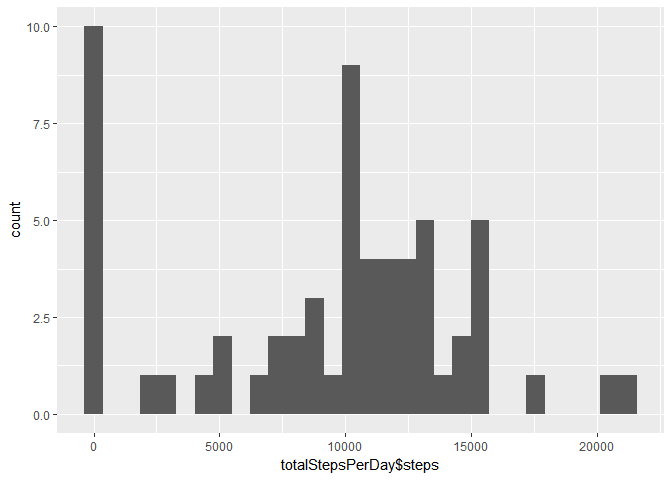
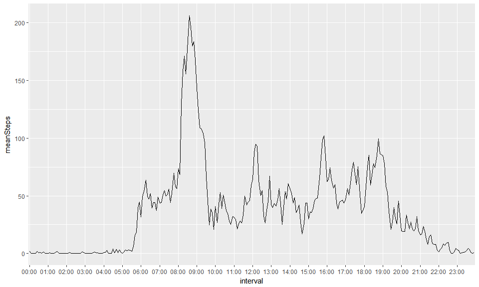
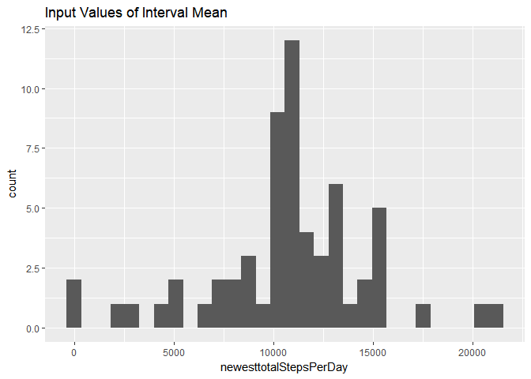
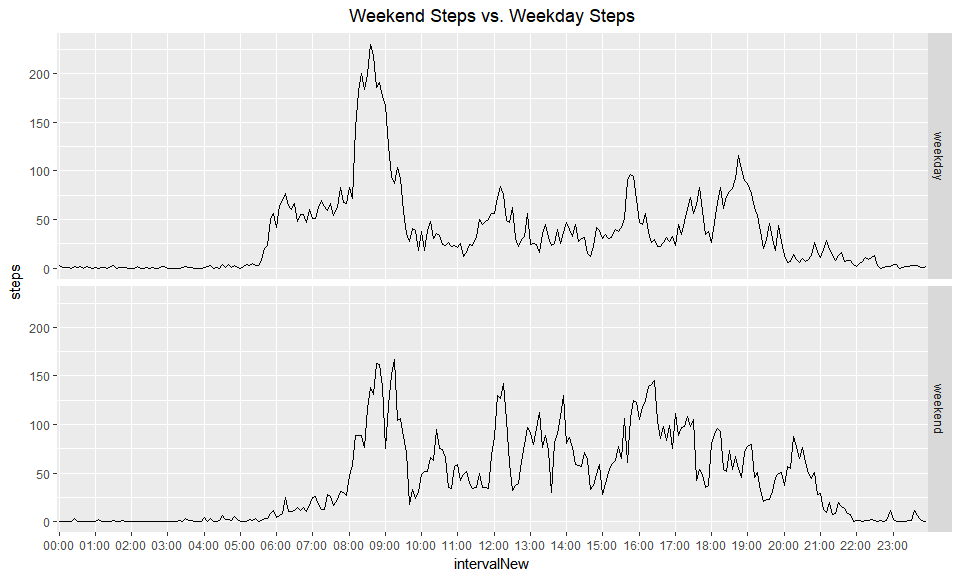

Loading and preprocessing the data
----------------------------------

    library(dplyr)

    ## 
    ## Attaching package: 'dplyr'

    ## The following objects are masked from 'package:stats':
    ## 
    ##     filter, lag

    ## The following objects are masked from 'package:base':
    ## 
    ##     intersect, setdiff, setequal, union

    library(stringi)
    library(stringr)
    library(ggplot2)

    download.file("https://d396qusza40orc.cloudfront.net/repdata%2Fdata%2Factivity.zip","~/activity.zip")
    if(!file.exists('activity.csv')){
            unzip('activity.zip')
    }
    activityData <- read.csv('activity.csv', header = TRUE)
    sapply(activityData, class)

    ##     steps      date  interval 
    ## "integer"  "factor" "integer"

    data <- activityData

    data$intervalNew <- ifelse(data$interval >= 100, format(strptime(gsub("([0-9]{1,2})([0-9]{2})", "\\1:\\2",    data$interval),"%H:%M"),"%H:%M"),ifelse(data$interval >=10,sub("^","00:", data$interval),sub("^","00:0", data$interval)))
                                   

    data$posixDate <- as.POSIXct(paste(data$date, data$intervalNew),format = "%Y-%m-%d %H:%M")

What is mean total number of steps taken per day?
-------------------------------------------------

#### 1. Make a histogram of the total number of steps taken each day

    totalStepsPerDay <- data %>%
            group_by(date) %>%
            summarise(sum(steps, na.rm = TRUE))
    names(totalStepsPerDay) <- c("day", "steps")
    qplot(totalStepsPerDay$steps, bins = 30)

#### 2. Calculate and report the mean and median total number of steps taken per day

-   Mean: 9354.2295082
-   Median: 10395

What is the average daily activity pattern?
-------------------------------------------

##### 1. Make a time series plot (i.e. type = "l") of the 5-minute interval (x-axis) and the average number of steps taken, averaged across all days (y-axis)

    length(unique(data$intervalNew))

    ## [1] 288

    averageStepsInterval <- data %>%
            group_by(intervalNew) %>%
            summarise(mean(steps, na.rm = TRUE))
    names(averageStepsInterval) <- c("interval", "meanSteps")
    ggplot(averageStepsInterval, aes(interval, meanSteps, group = 1)) + geom_line() +
            scale_x_discrete(breaks = unique(averageStepsInterval$interval)[seq(1,length(unique(averageStepsInterval$interval)),12)])

#### 2. Which 5-minute interval, on average across all the days in the dataset, contains the maximum number of steps?

-   Most Steps at: 08:35, 206.1698113

Imputing missing values
-----------------------

#### 1. Calculate and report the total number of missing values in the dataset (i.e. the total number of rows with NAs)

2304

#### 2. Devise a strategy for filling in all of the missing values in the dataset. The strategy does not need to be sophisticated. For example, you could use the mean/median for that day, or the mean for that 5-minute interval, etc.

-   [I will be using strategy found in second answer
    here](https://stackoverflow.com/questions/38687674/replace-na-with-mean-based-on-row-subset-matching-another-column)

#### 3. Create a new dataset that is equal to the original dataset but with the missing data filled in.

    newData <- data %>%
            group_by(intervalNew) %>%
            mutate(steps = ifelse(is.na(steps), mean(steps,na.rm =T), steps))
    length(which(is.na(newData$steps)))

    ## [1] 0

    # You could also use first method in that link.  I like dplyr because it's easier to read.
    # newestData <- data
    #newestData$steps <- with(newestData, ave(steps, intervalNew, FUN = function(x)
            #replace(x, is.na(x), mean(x, na.rm =T))))

#### 4. Make a histogram of the total number of steps taken each day and Calculate and report the mean and median total number of steps taken per day. Do these values differ from the estimates from the first part of the assignment? What is the impact of imputing missing data on the estimates of the total daily number of steps?

    newesttotalStepsPerDay <- tapply(newData$steps, newData$date, sum)
    qplot(newesttotalStepsPerDay, bins = 30, main = "Input Values of Interval Mean")

Are there differences in activity patterns between weekdays and weekends?
-------------------------------------------------------------------------

-   For this part the weekdays() function may be of some help here. Use
    the dataset with the filled-in missing values for this part.

#### 1. Create a new factor variable in the dataset with two levels - "weekday" and "weekend" indicating whether a given date is a weekday or weekend day.

#### 2. Make a panel plot containing a time series plot (i.e. type = "l") of the 5-minute interval (x-axis) and the average number of steps taken, averaged across all weekday days or weekend days (y-axis). See the README file in the GitHub repository to see an example of what this plot should look like using simulated data.

    newData$dateType <- ifelse(as.POSIXlt(newData$date)$wday %in% c(0,6), "weekend", "weekday")
    head(newData[newData$dateType == "weekend",])

    ## Source: local data frame [6 x 6]
    ## Groups: intervalNew [6]
    ## 
    ##   steps       date interval intervalNew           posixDate dateType
    ##   <dbl>     <fctr>    <int>       <chr>              <dttm>    <chr>
    ## 1     0 2012-10-06        0       00:00 2012-10-06 00:00:00  weekend
    ## 2     0 2012-10-06        5       00:05 2012-10-06 00:05:00  weekend
    ## 3     0 2012-10-06       10       00:10 2012-10-06 00:10:00  weekend
    ## 4     0 2012-10-06       15       00:15 2012-10-06 00:15:00  weekend
    ## 5     0 2012-10-06       20       00:20 2012-10-06 00:20:00  weekend
    ## 6     0 2012-10-06       25       00:25 2012-10-06 00:25:00  weekend

    averageActivityDOW <- newData %>% 
                    group_by(intervalNew, dateType) %>%
                    summarise(steps = mean(steps))
    head(averageActivityDOW)

    ## Source: local data frame [6 x 3]
    ## Groups: intervalNew [3]
    ## 
    ##   intervalNew dateType      steps
    ##         <chr>    <chr>      <dbl>
    ## 1       00:00  weekday 2.25115304
    ## 2       00:00  weekend 0.21462264
    ## 3       00:05  weekday 0.44528302
    ## 4       00:05  weekend 0.04245283
    ## 5       00:10  weekday 0.17316562
    ## 6       00:10  weekend 0.01650943

    ggplot(averageActivityDOW, aes(intervalNew, steps, group = 1)) + geom_line() + 
            facet_grid(dateType ~ .) +
            scale_x_discrete(breaks = unique(averageActivityDOW$intervalNew)[seq(1,length(unique(averageActivityDOW$intervalNew)),12)]) +
            ggtitle("Weekend Steps vs. Weekday Steps") +
            theme(plot.title = element_text(hjust = 0.5))

